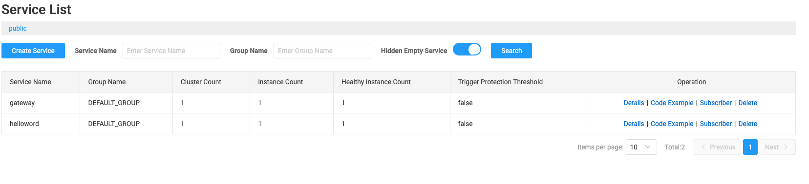

# API Gateway 使用指南

以下爲兩種常見路由模式：

1. **固定 URL 路由**（Static Routing）

2. **Nacos Discovery + LoadBalancer 動態路由**（Dynamic Routing）

---

## 1. 固定 URL 路由（Static Routing）

### 1.1 添加依賴

只需 Gateway 核心：

```xml
<dependency>
  <groupId>org.springframework.cloud</groupId>
  <artifactId>spring-cloud-starter-gateway</artifactId>
  <version>4.1.9</version> <!-- Spring Cloud 2023.x 版對應 -->
</dependency>
```

### Gateway Server

#### application.yaml

需要在gateway服務的`application.yaml`檔案中加上指定各個服務的各自要對應的路由

在application.yaml加上以下設定

```yaml
server:
  port: 8080

spring:
  application:
    name: gateway

  cloud:
    gateway:
      routes:
        - id: helloword
          uri: http://localhost:3000
          predicates:
            - Path=/hello/**
          filters:
            - StripPrefix=1
```

### 後端服務(EX: helloword)

在相關個後端服務中不需要進行什麼額外設定


### 啟動流程

在使用靜態路由情況下，因爲無法實踐服務發現所以比需要啟動各個後端服務(EX:helloword)，接著才能去啟動gateway服務。


---

## Nacos Discovery + LoadBalancer 動態路由（Dynamic Routing）

要在gateway中使用動態路由就必須要服務註冊中心，下面選擇`nacos`來作為服務註冊中心

### 架設 Nacos

這邊使用docker來架設

```bash
    docker run -d \
     -e MODE=standalone \
     -e PREFER_HOST_MODE=hostname \
     -p 8848:8848 \
     -p 9848:9848 \
     nacos/nacos-server:v2.4.3
```
1. **版本選擇**：建議 `v2.4.3`，與 Spring Boot 3.x、Spring Cloud 2023.x 相容，並修復 gRPC 穩定性問題。

2. **執行模式**：standalone

3. **埠口映射**：

   - HTTP: `-p 8848:8848`

   - gRPC: `-p 9848:9848`

   > Nacos 2.x Naming 客戶端**預設**經由 gRPC（9848）註冊與發現；若不映射此埠，客戶端會卡在 `STARTING` 無法連線。

### Gateway 服務中的各種設定

1. 添加依賴

```xml
<!-- Gateway 核心 -->
<dependency>
  <groupId>org.springframework.cloud</groupId>
  <artifactId>spring-cloud-starter-gateway</artifactId>
  <version>4.1.9</version>
</dependency>

<!-- Nacos Discovery -->
<dependency>
  <groupId>com.alibaba.cloud</groupId>
  <artifactId>spring-cloud-starter-alibaba-nacos-discovery</artifactId>
  <version>2023.0.3.3</version>
</dependency>

<!-- LoadBalancer -->
<dependency>
  <groupId>org.springframework.cloud</groupId>
  <artifactId>spring-cloud-starter-loadbalancer</artifactId>
  <version>4.1.6</version>
</dependency>
```

2. 在gateway服務中的application.yaml添加上下面設定

```yaml
spring:
  cloud:
    nacos:
      discovery:
        server-addr: localhost:8848  # 指向 Nacos HTTP 端口
    gateway:
      routes:
        - id: helloword
          uri: lb://helloword       # 動態路由前綴
          predicates:
            - Path=/hello/**
          filters:
            - StripPrefix=1
```

> `uri: lb://helloword` 中的`hellowrod`是對應到Nacos註冊的Service Name 


3. `GatewayApplication` 類加：

```java
@SpringBootApplication
@EnableDiscoveryClient
public class GatewayApplication { ... }
```

### 後端服務(EX: helloword)設定

1. 添加依賴

```xml
<dependency>
  <groupId>com.alibaba.cloud</groupId>
  <artifactId>spring-cloud-starter-alibaba-nacos-discovery</artifactId>
  <version>2023.0.3.3</version>
</dependency>
```

2. `application.yml` 中設定

```yaml
server:
  port: 3000

spring:
  application:
    name: helloword

  cloud:
    nacos:
      discovery:
        server-addr: localhost:8848
```

3. 並於 `HellowordApplication` 類加：

```java
@SpringBootApplication
@EnableDiscoveryClient
public class HellowordApplication { ... }
```

### 啟動流程

除了服務註冊中心(nacos)需要先行啟動之外，其他服務可以隨意啟動。

檔服務啟動完成後可以到nacos服務中的Service List頁面，已經註冊的服務。




